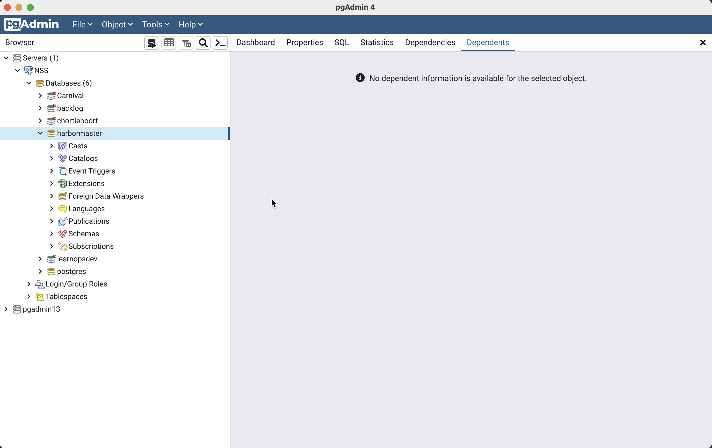

# Harbor Master: Handling POST Requests to Create a Ship

In this chapter, we'll implement a POST endpoint to create a new ship in our Harbor Master API. We'll focus on creating a ship that can be assigned to a dock, demonstrating how to handle relationships between entities.

## Learning Objectives

By the end of this chapter, you should be able to:
- Implement a data access method to insert a new ship with a relationship to a dock
- Create a POST endpoint that handles foreign key relationships
- Validate input data including foreign key constraints
- Return appropriate HTTP responses for created resources

## Implementing the Data Access Method

First, let's add a method to our `DatabaseService` class to create a new ship. Open the `Services/DatabaseService.cs` file and add the following method:

```csharp
// Create a new ship
public async Task<Ship> CreateShipAsync(Ship ship)
{
    using var connection = CreateConnection();
    await connection.OpenAsync();

    using var command = new NpgsqlCommand(
        @"INSERT INTO ships (name, type, dock_id)
          VALUES (@name, @type, @dockId)
          RETURNING id",
        connection);

    command.Parameters.AddWithValue("@name", ship.Name);
    command.Parameters.AddWithValue("@type", ship.Type);

    // Handle null DockId
    if (ship.DockId.HasValue)
    {
        command.Parameters.AddWithValue("@dockId", ship.DockId.Value);
    }
    else
    {
        command.Parameters.AddWithValue("@dockId", DBNull.Value);
    }

    // Execute the command and get the generated ID
    ship.Id = Convert.ToInt32(await command.ExecuteScalarAsync());

    return ship;
}

// Check if a dock exists and has available capacity
public async Task<bool> DockHasAvailableCapacityAsync(int dockId)
{
    using var connection = CreateConnection();
    await connection.OpenAsync();

    // First check if the dock exists
    using var checkDockCommand = new NpgsqlCommand(
        "SELECT 1 FROM docks WHERE id = @dockId",
        connection);
    checkDockCommand.Parameters.AddWithValue("@dockId", dockId);

    var dockExists = await checkDockCommand.ExecuteScalarAsync();
    if (dockExists == null)
    {
        return false; // Dock doesn't exist
    }

    /* Then check if the dock has available capacity

     🧨 This is how you can use SQL to do logical operations
     you might otherwise be tempted to do in code.
     Copy/pasta this SQL into pgAdmin and see the results
     for different dock IDs.
    */
    using var capacityCommand = new NpgsqlCommand(
        @"SELECT d.capacity > COUNT(s.id)
          FROM docks d
          LEFT JOIN ships s ON d.id = s.dock_id
          WHERE d.id = @dockId
          GROUP BY d.capacity",
        connection);
    capacityCommand.Parameters.AddWithValue("@dockId", dockId);

    var hasCapacity = await capacityCommand.ExecuteScalarAsync();

    // If the dock has no ships yet, hasCapacity will be null, but the dock has capacity
    return hasCapacity == null || Convert.ToBoolean(hasCapacity);
}
```



We've added two methods:
1. `CreateShipAsync` - Inserts a new ship record with an optional dock assignment
2. `DockHasAvailableCapacityAsync` - Checks if a dock exists and has available capacity

## Creating the POST Endpoint

Now, let's add a POST endpoint to our `ShipEndpoints` class. Open the `Endpoints/ShipEndpoints.cs` file and add the following code:

Add this directive to the top of the module.
```cs
using HarborMaster.Models;
```

Then add code that supports POST operations to `/ships`.

```csharp
// POST /ships - Create a new ship
app.MapPost("/ships", async (Ship ship, DatabaseService db) =>
{
    try
    {
        // Validate input
        if (string.IsNullOrWhiteSpace(ship.Name))
        {
            return Results.BadRequest("Name is required");
        }

        if (string.IsNullOrWhiteSpace(ship.Type))
        {
            return Results.BadRequest("Type is required");
        }

        // If a dock is specified, check if it exists and has capacity
        if (ship.DockId.HasValue)
        {
            bool dockHasCapacity = await db.DockHasAvailableCapacityAsync(ship.DockId.Value);
            if (!dockHasCapacity)
            {
                return Results.BadRequest("The specified dock does not exist or has no available capacity");
            }
        }

        // Create the ship
        var newShip = await db.CreateShipAsync(ship);

        // Return a 201 Created response with the location of the new resource
        return Results.Created($"/ships/{newShip.Id}", newShip);
    }
    catch (Exception ex)
    {
        return Results.Problem($"An error occurred while creating the ship: {ex.Message}");
    }
})
.WithOpenApi();
```

Let's take a closer look at how our POST endpoint is implemented:

1. Maps a POST request to the `/ships` route
2. Uses model binding to deserialize the request body into a `Ship` object
3. Validates the input data:
   - Checks that the name is not null or empty
   - Checks that the type is not null or empty
4. If a dock is specified (DockId is not null):
   - Checks if the dock exists and has available capacity
   - Returns a 400 Bad Request response if the dock doesn't exist or has no capacity
5. Creates a new ship using the `CreateShipAsync` method
6. Returns a 201 Created response with:
   - A Location header pointing to the new resource
   - The created ship object in the response body
7. Handles exceptions and returns a 500 Internal Server Error response with details

## Testing the POST Endpoint

Let's run the application and test our POST endpoint:

1. Restart your debugger

2. Test the `POST /ships` endpoint:
   - Enter a JSON request body:
     ```json
     {
       "name": "Black Pearl",
       "type": "Galleon",
       "dockId": 1
     }
     ```
   - Send the request
   - You should see a 201 Created response with the new ship details, including the generated ID

3. Test creating a ship without assigning it to a dock:
   - Enter a JSON request body:
     ```json
     {
       "name": "Flying Dutchman",
       "type": "Ghost Ship",
       "dockId": null
     }
     ```
   - Send the request
   - You should see a 201 Created response with the new ship details

4. Test the validation:
   - Try submitting with an empty name:
     ```json
     {
       "name": "",
       "type": "Galleon",
       "dockId": 1
     }
     ```
   - You should see a 400 Bad Request response with the message "Name is required"

   - Try submitting with a non-existent dock ID:
     ```json
     {
       "name": "HMS Interceptor",
       "type": "Brig",
       "dockId": 999
     }
     ```
   - You should see a 400 Bad Request response with the message "The specified dock does not exist or has no available capacity"

   - Try to create a ship and assign it to a dock that doesn't have capacity:
     ```json
     {
       "name": "HMS Interceptor",
       "type": "Brig",
       "dockId": 1
     }
     ```
   - You should see a 400 Bad Request response with the message "The specified dock does not exist or has no available capacity"

5. Verify the ships were created:
   - Use the `GET /ships` endpoint to see all ships
   - You should see your new ships in the list

## Conclusion

In this chapter, you've learned how to implement a POST endpoint to create a new ship in the Harbor Master API. You've implemented a data access method to insert a new ship record with an optional dock assignment, created a POST endpoint that handles foreign key relationships, validated input data including foreign key constraints, and returned appropriate HTTP responses for created resources.

In the next chapter, you'll implement POST operations for haulers as an exercise.

## Additional Reading

There is a bit of "magic" happening in some parts of this code that are not obvious and can be a source of confusion for beginners.

For example, in the **ShipEndpoints** module, the code that handles POST operations to `/ships` is very concise and abstract.

```cs
app.MapPost("/ships", async (Ship ship, DatabaseService db)
```

How does that function know that it will receive data in the form a ship, and how is the database service provided as an argument? The only relevant code in `Program.cs` is:

```cs
app.MapShipEndpoints();
```

You never *see* where those arguments are provided to the `MapPost()` method.

Before moving to the next feature chapter, you can read about how <a href="./harbor-master-dependency-injection.md" target="_blank">Dependency Injection and Model Binding</a> works in minimal API projects. Then come back to this tab and move on to the next chapter.

## Next Steps

[Continue to the next chapter: Implementing POST Operations for Haulers (Exercise)](./harbor-master-post-haulers.md)