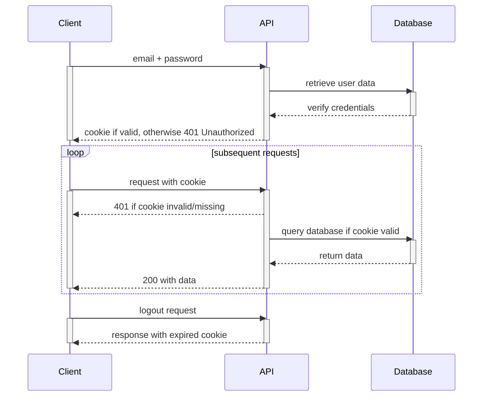

# Introduction to Authentication

In this chapter, we'll introduce the concepts of authentication and authorization and how they are implemented in ASP.NET Core applications using Identity Framework.

## What is Authentication?

**Authentication** is the process of verifying who a user is. When a user logs into an application, they are authenticating themselves - proving they are who they claim to be, typically by providing credentials like a username/email and password.

## What is Authorization?

**Authorization** is the process of determining what a user is allowed to do. Once a user is authenticated, authorization determines what resources they can access and what actions they can perform.

## Why Do We Need Authentication and Authorization?

Most applications need to:
- Protect sensitive data from unauthorized access
- Provide personalized experiences for different users
- Restrict certain actions to specific user roles (like administrators)
- Track user activity and maintain user-specific data

## ASP.NET Core Identity

ASP.NET Core Identity is a membership system that adds login functionality to ASP.NET Core applications. It provides:

- User registration and login
- Password hashing and security
- Role-based authorization
- External login providers (like Google, Facebook)
- Account confirmation and password recovery

## How Authentication Works with Cookies

ASP.NET Core Identity uses cookies to maintain user sessions. Here's a simplified flow:

1. A user sends their credentials (email/username and password) to the server
2. The server verifies these credentials against stored user data
3. If valid, the server creates a cookie containing user information
4. The browser stores this cookie and sends it with subsequent requests
5. The server validates the cookie on each request to identify the user

## Setting Up a Project with Authentication

In the next chapter, we'll create a new project with authentication enabled and implement user registration and login functionality. We'll build a simple application that demonstrates these concepts in a beginner-friendly way.

## Key Concepts to Remember

- **Authentication**: Verifying who a user is
- **Authorization**: Determining what a user can do
- **Identity Framework**: ASP.NET Core's built-in authentication system
- **Cookies**: How user sessions are maintained between requests

## Next Steps

In the next chapter, we'll set up a new project with Identity Framework and implement user registration and login functionality.

[Next: User Registration and Login](./auth-registration-login.md)