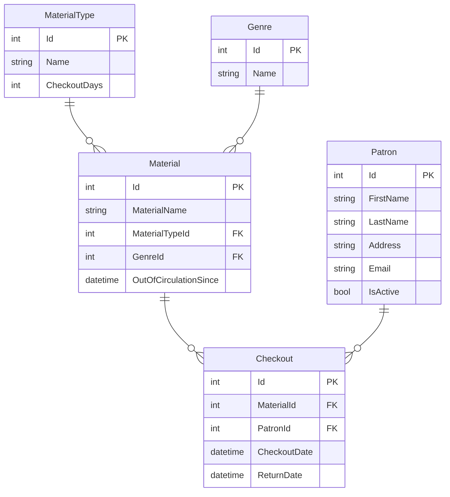

# Introduction to DTOs in Loncotes County Library

## What are DTOs?

DTO stands for Data Transfer Object. DTOs are objects that define the structure of the JSON that will be in an HTTP response from the API. They are simple objects that don't contain any business logic but may contain serialization and deserialization logic.

For example, you could have a database model class for a user that has sensitive information—like a social security number.

```cs
public class User {
    public string name { get; set; }
    public string address { get; set; }
    public string SSN { get; set; }
}
```

Now, when a client wants to get user information, you don't want the SSN to be exposed to the client, so you would create a separate class that would exclude it.

```cs
public class UserDTO {
    public string name { get; set; }
    public string address { get; set; }
}
```

Your logic will use **this** class to construct the JSON response body.

### Why use DTOs?

1. **Separation of Concerns**: DTOs separate your domain/database models from the data you expose to clients.
2. **Control over API Responses**: You can customize exactly what data is sent to clients.
3. **Versioning**: You can evolve your API without changing database models.
4. **Security**: You can hide sensitive data from being exposed.
5. **Calculated Properties**: You can include properties that don't exist in your database models but are calculated from them.

## The Loncotes County Library Project

The Loncotes County Library has hired us to build a new web application to manage their patrons, materials, and checkouts. We will be building the app to be used with their existing database, but you will need to create your own for local development based on the data model of the library's. Eventually, the app will be used by patrons and librarians, but a pilot program for the first version will only be used by the librarians.

This is the ERD for the library's database:



## Project Structure

In our approach, we'll organize our endpoints, models, DTOs, and services in separate files, following the pattern of separating endpoints by functionality. This approach offers several benefits:

1. **Better organization** - Endpoints are grouped by functionality, making them easier to find and modify.
2. **Improved maintainability** - The `Program.cs` file remains clean and focused on configuration.
3. **Scalability** - As your application grows, you can add new endpoint classes without cluttering `Program.cs`.
4. **Testability** - Endpoint classes can be tested independently.

Here's how we'll structure our project:

```
LoncotesLibrary/
├── Endpoints/
│   ├── MaterialEndpoints.cs
│   ├── PatronEndpoints.cs
│   └── CheckoutEndpoints.cs
├── Models/
│   ├── Material.cs
│   ├── MaterialType.cs
│   ├── Genre.cs
│   ├── Patron.cs
│   └── Checkout.cs
├── DTOs/
│   ├── MaterialDto.cs
│   ├── PatronDto.cs
│   └── CheckoutDto.cs
├── Data/
│   └── LoncotesLibraryDbContext.cs
├── Mapping/
│   └── AutoMapperProfiles.cs
├── Program.cs
└── ...
```

## Setting up the API

1. In the csharp directory of your workspace create the web api project like this:
   ```bash
   dotnet new web -n LoncotesLibrary
   cd LoncotesLibrary
   ```

2. Inside the `LoncotesLibrary` directory, run:
   ```bash
   dotnet new gitignore
   ```

3. Install these required dependencies:
   ```bash
   dotnet add package Npgsql.EntityFrameworkCore.PostgreSQL --version 8.0
   ```
   and:
   ```bash
   dotnet add package Microsoft.EntityFrameworkCore.Design --version 8.0
   ```
   and:
   ```bash
   dotnet add package AutoMapper.Extensions.Microsoft.DependencyInjection --version 12.0.1
   ```

4. Run this to be able to store secrets for this app:
   ```bash
   dotnet user-secrets init
   ```

5. Add the connection string to the secrets for this app (make sure you change `<your_postgresql_password>` to your db password!):
   ```bash
   dotnet user-secrets set 'LoncotesLibraryDbConnectionString' 'Host=localhost;Port=5432;Username=postgres;Password=<your_postgresql_password>;Database=LoncotesLibrary'
   ```

6. Create the necessary directories for our project structure:
   ```bash
   mkdir Models DTOs Endpoints Data Mapping
   ```

7. Refer to the [debugging chapter](../../book-1-csharp-sql/chapters/debugging-csharp.md) to create your `.vscode/launch.json` and `.vscode/tasks.json`. Replace all instances of **HarborMaster** with **LoncotesLibrary**.

## Creating Model Classes

Create the following database models based on the ERD:

```csharp
// Models/Material.cs
public class Material
{
    public int Id { get; set; }
    public string MaterialName { get; set; }
    [Required]
    public int MaterialTypeId { get; set; }
    public MaterialType MaterialType { get; set; }
    [Required]
    public int GenreId { get; set; }
    public Genre Genre { get; set; }
    public DateTime? OutOfCirculationSince { get; set; }
    public List<Checkout> Checkouts { get; set; }
}

// Models/MaterialType.cs
public class MaterialType
{
    public int Id { get; set; }
    public string Name { get; set; }
    [Required]
    public int CheckoutDays { get; set; }
    public List<Material> Materials { get; set; }
}

// Models/Genre.cs
public class Genre
{
    public int Id { get; set; }
    public string Name { get; set; }
    public List<Material> Materials { get; set; }
}

// Models/Patron.cs
public class Patron
{
    public int Id { get; set; }
    [Required]
    public string FirstName { get; set; }
    [Required]
    public string LastName { get; set; }
    [Required]
    public string Address { get; set; }
    [Required]
    public string Email { get; set; }
    public bool IsActive { get; set; }
    public List<Checkout> Checkouts { get; set; }
}

// Models/Checkout.cs
public class Checkout
{
    public int Id { get; set; }
    [Required]
    public int MaterialId { get; set; }
    public Material Material { get; set; }
    [Required]
    public int PatronId { get; set; }
    public Patron Patron { get; set; }
    [Required]
    public DateTime CheckoutDate { get; set; }
    public DateTime? ReturnDate { get; set; }
    public bool Paid { get; set; }
}
```

## Creating DTO Classes

Now, let's create DTO classes that correspond to each of our database models. These will define how our data is presented to clients.

```csharp
// DTOs/MaterialDto.cs
public class MaterialDto
{
    public int Id { get; set; }
    public string MaterialName { get; set; }
    public int MaterialTypeId { get; set; }
    public MaterialTypeDto MaterialType { get; set; }
    public int GenreId { get; set; }
    public GenreDto Genre { get; set; }
    public DateTime? OutOfCirculationSince { get; set; }
}

// DTOs/MaterialTypeDto.cs
public class MaterialTypeDto
{
    public int Id { get; set; }
    public string Name { get; set; }
    public int CheckoutDays { get; set; }
}

// DTOs/GenreDto.cs
public class GenreDto
{
    public int Id { get; set; }
    public string Name { get; set; }
}

// DTOs/PatronDto.cs
public class PatronDto
{
    public int Id { get; set; }
    public string FirstName { get; set; }
    public string LastName { get; set; }
    public string Address { get; set; }
    public string Email { get; set; }
    public bool IsActive { get; set; }

    // This is a calculated property that doesn't exist in the database model
    public string FullName => $"{FirstName} {LastName}";
}

// DTOs/CheckoutDto.cs
public class CheckoutDto
{
    public int Id { get; set; }
    public int MaterialId { get; set; }
    public MaterialDto Material { get; set; }
    public int PatronId { get; set; }
    public PatronDto Patron { get; set; }
    public DateTime CheckoutDate { get; set; }
    public DateTime? ReturnDate { get; set; }
}
```

Notice how we've added a calculated property `FullName` to the `PatronDto` that doesn't exist in the `Patron` model. This is one of the advantages of using DTOs - we can add properties that are calculated from the model data but don't exist in the database.

## Setting up AutoMapper

AutoMapper is a library that simplifies the mapping between objects. It uses a convention-based approach to map properties from one object to another, based on property names.

Let's create a profile class that defines the mapping between our domain models and DTOs:

```csharp
// Mapping/AutoMapperProfiles.cs
using AutoMapper;
using LoncotesLibrary.Models;
using LoncotesLibrary.DTOs;

namespace LoncotesLibrary.Mapping
{
    public class AutoMapperProfiles : Profile
    {
        public AutoMapperProfiles()
        {
            CreateMap<Material, MaterialDto>();
            CreateMap<MaterialType, MaterialTypeDto>();
            CreateMap<Genre, GenreDto>();
            CreateMap<Patron, PatronDto>();
            CreateMap<Checkout, CheckoutDto>();
        }
    }
}
```

This profile defines mappings between our domain models and DTOs. AutoMapper will automatically map properties with the same name from the source object to the destination object.

## Setting up the DbContext

Create a `LoncotesLibraryDbContext.cs` file in the `Data` directory:

```csharp
// Data/LoncotesLibraryDbContext.cs
using Microsoft.EntityFrameworkCore;
using LoncotesLibrary.Models;

namespace LoncotesLibrary.Data
{
    public class LoncotesLibraryDbContext : DbContext
    {
        public DbSet<Material> Materials { get; set; }
        public DbSet<MaterialType> MaterialTypes { get; set; }
        public DbSet<Genre> Genres { get; set; }
        public DbSet<Patron> Patrons { get; set; }
        public DbSet<Checkout> Checkouts { get; set; }

        public LoncotesLibraryDbContext(DbContextOptions<LoncotesLibraryDbContext> context) : base(context) { }

        protected override void OnModelCreating(ModelBuilder modelBuilder)
        {
            // Seed data
            modelBuilder.Entity<MaterialType>().HasData(new MaterialType[]
            {
                new MaterialType { Id = 1, Name = "Book", CheckoutDays = 14 },
                new MaterialType { Id = 2, Name = "CD", CheckoutDays = 7 },
                new MaterialType { Id = 3, Name = "DVD", CheckoutDays = 7 }
            });

            modelBuilder.Entity<Genre>().HasData(new Genre[]
            {
                new Genre { Id = 1, Name = "Fiction" },
                new Genre { Id = 2, Name = "Non-Fiction" },
                new Genre { Id = 3, Name = "Science Fiction" },
                new Genre { Id = 4, Name = "Fantasy" },
                new Genre { Id = 5, Name = "Biography" }
            });

            modelBuilder.Entity<Patron>().HasData(new Patron[]
            {
                new Patron { Id = 1, FirstName = "John", LastName = "Doe", Address = "123 Main St", Email = "john@example.com", IsActive = true },
                new Patron { Id = 2, FirstName = "Jane", LastName = "Smith", Address = "456 Elm St", Email = "jane@example.com", IsActive = true }
            });

            modelBuilder.Entity<Material>().HasData(new Material[]
            {
                new Material { Id = 1, MaterialName = "The Great Gatsby", MaterialTypeId = 1, GenreId = 1 },
                new Material { Id = 2, MaterialName = "1984", MaterialTypeId = 1, GenreId = 3 },
                new Material { Id = 3, MaterialName = "The Hobbit", MaterialTypeId = 1, GenreId = 4 },
                new Material { Id = 4, MaterialName = "Steve Jobs", MaterialTypeId = 1, GenreId = 5 },
                new Material { Id = 5, MaterialName = "The Beatles: Abbey Road", MaterialTypeId = 2, GenreId = 1 },
                new Material { Id = 6, MaterialName = "Inception", MaterialTypeId = 3, GenreId = 3 },
                new Material { Id = 7, MaterialName = "The Lord of the Rings: The Fellowship of the Ring", MaterialTypeId = 3, GenreId = 4 },
                new Material { Id = 8, MaterialName = "A Brief History of Time", MaterialTypeId = 1, GenreId = 2 },
                new Material { Id = 9, MaterialName = "The Shawshank Redemption", MaterialTypeId = 3, GenreId = 1 },
                new Material { Id = 10, MaterialName = "The Dark Side of the Moon", MaterialTypeId = 2, GenreId = 1 }
            });

            modelBuilder.Entity<Checkout>().HasData(new Checkout[]
            {
                new Checkout
                {
                    Id = 1,
                    MaterialId = 1,
                    PatronId = 1,
                    CheckoutDate = DateTime.Now.AddDays(-14),
                    ReturnDate = DateTime.Now.AddDays(-7),
                    Paid = true
                },
                new Checkout
                {
                    Id = 2,
                    MaterialId = 2,
                    PatronId = 1,
                    CheckoutDate = DateTime.Now.AddDays(-7),
                    ReturnDate = null,
                    Paid = false
                },
                new Checkout
                {
                    Id = 3,
                    MaterialId = 3,
                    PatronId = 2,
                    CheckoutDate = DateTime.Now.AddDays(-21),
                    ReturnDate = DateTime.Now.AddDays(-10),
                    Paid = true
                },
                new Checkout
                {
                    Id = 4,
                    MaterialId = 5,
                    PatronId = 2,
                    CheckoutDate = DateTime.Now.AddDays(-3),
                    ReturnDate = null,
                    Paid = false
                },
                new Checkout
                {
                    Id = 5,
                    MaterialId = 7,
                    PatronId = 1,
                    CheckoutDate = DateTime.Now.AddDays(-30),
                    ReturnDate = null,
                    Paid = false
                }
            });
        }
    }
}
```

## Update Program.cs

Update your `Program.cs` file to include the DbContext configuration and register AutoMapper:

```csharp
using LoncotesLibrary.Data;
using LoncotesLibrary.Mapping;
using Microsoft.EntityFrameworkCore;

var builder = WebApplication.CreateBuilder(args);

// Add services to the container
builder.Services.AddNpgsql<LoncotesLibraryDbContext>(builder.Configuration["LoncotesLibraryDbConnectionString"]);

// Add AutoMapper
builder.Services.AddAutoMapper(typeof(AutoMapperProfiles));

// Add CORS
builder.Services.AddCors(options =>
{
    options.AddDefaultPolicy(policy =>
    {
        policy.WithOrigins("http://localhost:3000")
              .AllowAnyHeader()
              .AllowAnyMethod();
    });
});

var app = builder.Build();

// Configure the HTTP request pipeline
app.UseCors();

app.Run();
```

## Create the Initial Migration

Run the following commands to create and apply the initial migration:

```bash
dotnet ef migrations add InitialCreate
dotnet ef database update
```

In the next chapter, we'll start implementing endpoints that use these DTOs to provide rich, calculated responses to clients.

Up Next: [Basic Features with DTOs](./loncotes-dto-basic-features.md)