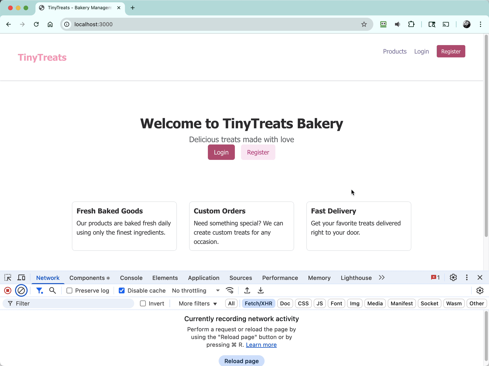

# Client Authentication

Now it is time for you to start the React client if you haven't yet, and verify that the users and roles endpoints are working.

## Start the client

Go to the directory where you cloned the client repo. If it is not currently running, execute the following command in the terminal:

```sh
npm run dev
```

Then open a new tab in your browser and visit the URL that the client application is running on.

## Authenticating



1. Make sure your browser's Dev Tools are open and you are inspecting **Network** traffic.
2. Click on the **Login** button.
3. Enter in the username and password of an admin user, which you can get from the DbContext class in your API project.
4. Click the **Login** button.

You should now see the admin dashboard which includes two sections:

- Order Management
- User Management

## Viewing the requests

1. In the **Network** dev panel, view the request payload for the login to see the structure of the request payload
2. View the **Headers** > **Request URL** for the `/me` request, and then look at the **Response** JSON data.
3. View the **Headers** > **Request URL** for the `/roles` request, and then look at the **Response** JSON data.

## Next steps

In the next chapter, we'll implement product management endpoints to allow users to browse and manage bakery products.


[Next: Product management endpoints](./tinytreats-product-endpoints.md)